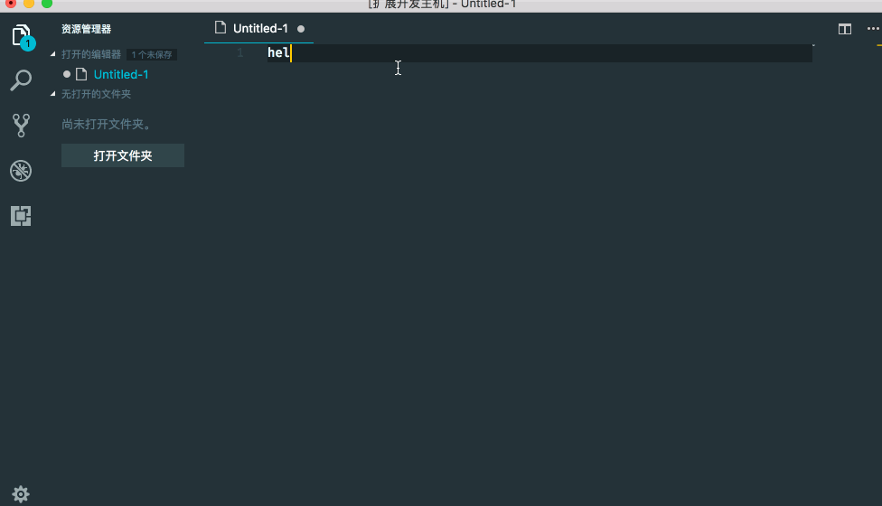

# 一个变量类型转化的`vscode`插件

现在插件支持的变量转化类型有：
1. 驼峰格式 <-> 连接符格式 （varTypes <-> var-types）
2. 驼峰格式 <-> 全大写下划线格式 （varTypes <-> VAR_TYPES） 

## 使用方法

在编辑器中选中需要转化的字符串，`command + shift + p` 或者 `ctrl + shift + p` 选择`varTypes: xxx`命令进行格式化
